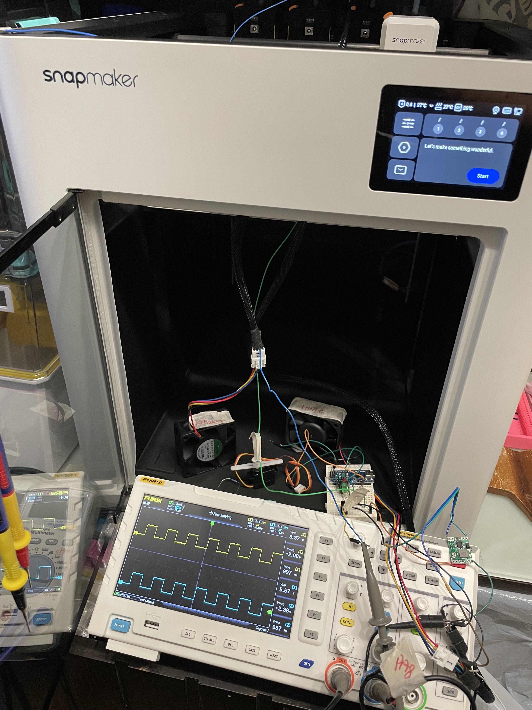
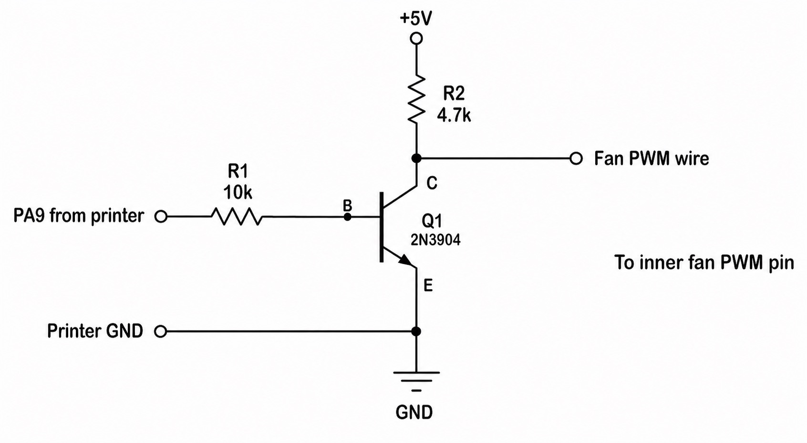

# Snapmaker U1 Black Box Dual PWM Fan Mod


A custom Snapmaker U1 project to build my own external **Black Box** for dual PWM fan control, based on reverse-engineering the U1 purifier firmware path.

This project started when I compared the old purifier config with the newer V1.3.0 firmware version and found a very important change: `PA9` used to be a tachometer input, but in the newer config it became the PWM control output for the inner fan, while tach feedback moved to `PA6`.

That discovery changed everything. Instead of waiting for the official top-cover hardware, I decided to build my own solution and document the whole journey.



## Why this project exists

The purpose of this project is to turn a firmware finding into a real hardware mod.

By comparing the purifier settings across firmware versions, I found that the design had already evolved from a single-fan layout into a dual-fan layout with separate `exhaust` and `inner` fan control paths.

That means the software side was already pointing in the right direction. My job now is to build the hardware that makes that design practical.

## The key finding

In the old purifier config:

```ini
[purifier]
pin: !PA8
max_power: 1.0
tachometer_pin: PA9
tachometer_ppr: 2
tachometer_poll_interval: 0.0005
enable_pin: PE15
extra_fan_tach_pin: PA6
power_det_pin: PA7
power_det_threshold: 0.88
```

In the newer V1.3.0 purifier config:

```ini
[purifier]
# exhaust fan
exhaust_pin: !PA8
exhaust_max_power: 1.0
exhaust_cycle_time: 0.001
exhaust_hardware_pwm: True
# inner fan
inner_pin: !PA9
inner_max_power: 1.0
inner_cycle_time: 0.001
inner_hardware_pwm: True
inner_tach_pin: PA6
inner_tach_ppr: 2
inner_tach_poll_interval: 0.0005
# global
power_enable_pin: PE15
power_det_pin: PA7
power_det_threshold: 0.88
external_temp_sensor: cavity
```

The change is clear:

- `PA8` remains a fan-control output.
- `PA9` changes from tach input to PWM output for the inner fan.
- `PA6` becomes the tach feedback pin for the inner fan.

That role change on `PA9` is the core technical trigger for this repo.

## What the Black Box does

The Black Box is designed to sit between the 6-pin header at the top of the Snapmaker U1 and two PWM fans:

- One exhaust fan
- One inner air-circulation fan

The exhaust fan path is planned to include a servo-controlled vent shutter so the outlet can be closed and kept air-tight when the system is off.

The inner fan is intended for chamber air circulation, following the same general idea as the stock purifier concept with HEPA and active-carbon filtration.

The most important part of the electronics is the conversion of the original `PA9` tach-oriented path into a fan-friendly PWM control path.

## Current hardware direction

The current proof-of-concept conversion stage uses a simple transistor interface:

- `Q1`: 2N3904
- `R1`: 10k from `PA9` to transistor base
- `R2`: 4.7k pull-up to `+5V`
- `DC-2-DC Buck Converter`: 24V to 5V step-down to drive PWM signal, e.g. MP1854
- collector output to the fan PWM wire
- shared ground with the printer

This is intended to behave more like the open-collector style PWM interface expected by a standard 4-wire fan.

I am now moving from bench testing toward designing my first custom PCB in KiCad.

## DIY - No waiting is needed
*** For anyone with soldering experience, you don't need to wait for my PCB. Just put all the above electronic components together on a perfboard or stripboard, and you'll have a Tach-to-PWM converter. 

Pls find below the circuit diagram.


## PCB roadmap

The goal of the custom PCB is to integrate:

1. A conversion circuit that changes `PA9` from tach to PWM.
2. A 24V/12V fan selector.
3. An Arduino or ESP32 board.
4. Servo control for a vent shutter.
5. A DC-to-DC buck converter.
6. A PPTC 24V 1A fuse on the input power rail.

This board is meant to turn the current proof-of-concept wiring into a cleaner, safer, and more expandable system.

## User control

The purifier module already supports two fan channels, `exhaust` and `inner`, and can be controlled directly with G-code.

Basic examples:
```gcode
SET_PURIFIER FAN=exhaust SPEED=0.8 DELAY_OFF=180
SET_PURIFIER FAN=inner SPEED=0.6 DELAY_OFF=120
SET_PURIFIER FAN=exhaust SPEED=0
SET_PURIFIER FAN=inner SPEED=0
GET_PURIFIER
```

It also supports mode-based control and chamber-related workflows:
```gcode
SET_PURIFIER_MODE MODE=1 FAN_SPEED=0.6 DESIRE_TEMP=40 ALARM_TEMP=45 DELAY_OFF=180 DYNAMIC_FAN_CONTROL=1
SET_PURIFIER_MODE MODE=2 DESIRE_TEMP=50 FAN_SPEED=0.6 DELAY_OFF=180
WAIT_CHAMBER_TEMP TIMEOUT=300
```

More details are in [`docs/purifier-manual.md`](docs/purifier-manual.md)

<a href="https://github.com/WilliamTheMaker/BuildMyOwnBlackBox_for_Snapmaker_U1/raw/main/docs/purifier-manual-revised.html" target="_blank" rel="noopener noreferrer">Click here to show and download the raw HTML format</a>

## My background

I have been building custom 3D printers since 2013, starting with a Delta Mini.

My Voron V2.4 was built in 2021 and evolved through several iterations into a wide-edition 6AWD IDEX machine.

The Snapmaker U1 is the first consumer 3D printer I have purchased. I bought it as a backup machine so I could still print structural parts while my custom Voron was disassembled.

## Why AI matters here

This project is also a personal learning story.

AI helped me move faster through firmware reading, digital I/O concepts, MCU behavior, PWM fan control, circuit ideas, and debugging strategy. It did not replace hands-on work, but it made the learning loop much tighter and much more productive.

For me, this project is one example of how AI can be a practical tool for maker-level electronics learning, especially when combined with reverse-engineering and bench testing.

## Support

If this project is useful to you and you want to support continued development, you can support me via **Ko-fi**.

Support helps fund parts, prototyping, test hardware, PCB revisions, and time spent documenting the project.

[](https://ko-fi.com/williamthemaker)

## Commercial use

This project is shared for documentation, learning, and community discussion.

Commercial manufacturing, resale, redistribution of design files, or use of this project in products for sale is **not permitted** without my prior written permission.

If you are interested in licensing, collaboration, sponsored development, or an official manufacturing arrangement, please contact me directly.

## Repository structure

```text
README.md
LICENSE.md
docs/
  hardware-plan.md
  purifier-manual-revised.html
  purifier-manual.md
  reverse-engineering-notes.md
  user-manual.md
images/
  README.md
  pa9-to-pwm-conversion.jpg
  prototyping.jpg
```

## Related docs

- [`docs/reverse-engineering-notes.md`](docs/reverse-engineering-notes.md)
- [`docs/hardware-plan.md`](docs/hardware-plan.md)
- [`docs/purifier-manual.md`](docs/purifier-manual.md)
- [`docs/purifier-manual-revised.html (HTML format of purifier manual)`](docs/purifier-manual-revised.html)
- [`docs/user-manual.md`](docs/user-manual.md) 

## Disclaimer

This is an unofficial modding and learning project.

Anyone reproducing this work should verify pinout, grounding, power rail selection, current limits, and fan compatibility before connecting hardware to a printer.

## License

This repository is currently shared under an **All Rights Reserved** model.

Please read [`LICENSE.md`](LICENSE.md) before reusing any part of this project.
